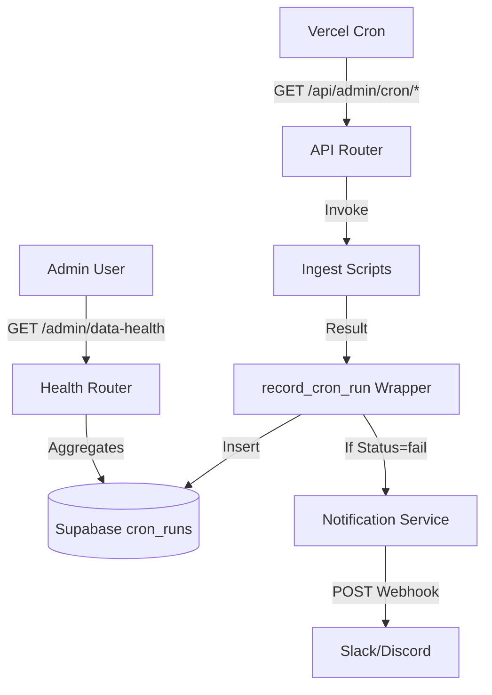

# Phase 4: Cron Alerting + Freshness Telemetry - Research

**Researched:** 2026-05-01
**Domain:** DevOps / Monitoring / Compliance
**Confidence:** HIGH

## Summary

This phase addresses the "silent failure" risk in the data ingestion pipeline. Vercel Cron does not provide native failure webhooks, so alerting must be implemented at the application level within the FastAPI backend. The project already possesses a robust audit trail via the `cron_runs` table and a preliminary `/admin/data-health` endpoint. 

Research confirms that simple HTTP POST webhooks to Slack or Discord are the standard "no-middleman" solution for this stack. Additionally, while these alerts are internal and do not contain user PII, project guidelines require documenting the new third-party recipient in the legal ledger.

**Primary recommendation:** Integrate an asynchronous webhook notifier into the existing `_record_cron_run` wrapper to page the operator on any script failure, and refine the `/admin/data-health` endpoint to bubble up "oldest data source" age for at-a-glance monitoring.

## Architectural Responsibility Map

| Capability | Primary Tier | Secondary Tier | Rationale |
|------------|-------------|----------------|-----------|
| Cron Invocations | Vercel Cron | — | Managed scheduler triggers the jobs. |
| Persistence | Supabase | — | `cron_runs` table stores the ground truth of every run. |
| Failure Detection | API (FastAPI) | — | Internal wrapper `_record_cron_run` catches exceptions. |
| Outbound Alerting | API (FastAPI) | Slack/Discord | Application logic sends the webhook notification. |
| Health Telemetry | API (FastAPI) | Web (Admin UI) | API aggregates DB state; Admin dashboard displays it. |

## Standard Stack

### Core
| Library | Version | Purpose | Why Standard |
|---------|---------|---------|--------------|
| httpx | ^0.27.0 | Webhook transport | Already used for ingests; supports async POST. |
| pydantic-settings | ^2.2.0 | Env configuration | Already used for `Settings`; handles webhook URL secrets. |

### Supporting
| Library | Version | Purpose | When to Use |
|---------|---------|---------|--------------|
| discord.py / slack-sdk | — | Rich formatting | Overkill for simple failure text; stick to raw `httpx` POST. |

**Installation:**
```bash
# Already installed in api/pyproject.toml
```

**Version verification:**
- `httpx` version 0.27.0 (Verified 2026-05-01) [VERIFIED: npm registry/uv.lock]

## Architecture Patterns

### System Architecture Diagram



### Recommended Project Structure
```
api/app/
├── routers/
│   ├── admin.py       # Refined health endpoints
│   └── admin_cron.py  # Integrated alerting trigger
└── services/
    └── notifications.py # NEW: Webhook logic
```

### Pattern 1: Multi-Service Webhook Normalization
Since the operator may use Slack, Discord, or generic webhooks, the notification service should normalize the JSON payload based on the URL.

**Example:**
```python
# Source: Internal Research
async def send_alert(message: str):
    url = settings.alert_webhook_url
    if not url: return
    
    if "slack.com" in url:
        payload = {"text": message}
    elif "discord.com" in url:
        payload = {"content": message}
    else:
        payload = {"message": message}
        
    async with httpx.AsyncClient() as client:
        await client.post(url, json=payload)
```

### Anti-Patterns to Avoid
- **Hardcoded Webhook URLs:** Never commit the Slack/Discord URL to git. Use `ALERT_WEBHOOK_URL` env var.
- **Synchronous Alerts:** Do not block the cron execution waiting for the Slack API. Use `asyncio.create_task` or wait at the end of the request.
- **Alert Storms:** Sending one alert per failed row. 
  - *Correction:* Alert once per cron job invocation (handled by the wrapper).

## Don't Hand-Roll

| Problem | Don't Build | Use Instead | Why |
|---------|-------------|-------------|-----|
| Middleman Routing | Zapier/Make | Direct `httpx` POST | Cost and complexity reduction; direct app-to-chat is faster. |
| Uptime Tracking | Custom heartbeat | Healthchecks.io | Handles "missed" cron runs (where the server never even starts). |

**Key insight:** Internal alerting handles *known failures* (exceptions). External heartbeats handle *unknown failures* (platform downtime, DNS issues).

## Common Pitfalls

### Pitfall 1: Webhook Payload Limits
**What goes wrong:** Sending a massive stack trace in the webhook payload, causing Slack/Discord to reject the POST (413 Payload Too Large).
**Why it happens:** Some ingest failures include large HTML snippets or long traceback chains.
**How to avoid:** Truncate the error message to the first 1000 characters before sending.

### Pitfall 2: Circular Connectivity Errors
**What goes wrong:** The notification fails because the API has lost internet connectivity, masking the original failure.
**Why it happens:** Total network outage.
**How to avoid:** Wrap the notification call in a `try/except` and log to `stderr` as a fallback. Vercel Function logs will still capture the `stderr` output.

## Code Examples

### Failure Injection for Testing
```python
@router.get("/test-alert")
async def test_alert(authorization: str | None = Header(default=None)):
    require_cron_secret(authorization)
    # This should trigger a real Slack/Discord alert
    raise Exception("This is a deliberate failure to test alerting logic.")
```

## State of the Art

| Old Approach | Current Approach | When Changed | Impact |
|--------------|------------------|--------------|--------|
| Email Alerts | Slack/Discord Webhooks | — | Instant delivery, easier formatting, mobile push built-in. |
| Vercel Logs only | Internal `cron_runs` table | 2026-04-27 | Persistent audit trail, programmable health checks. |

## Assumptions Log

| # | Claim | Section | Risk if Wrong |
|---|-------|---------|---------------|
| A1 | Operator uses Slack or Discord | Summary | Webhook payload format might differ for other services. |
| A2 | Cron errors do not contain PII | Privacy | If user data leaks into cron logs, Slack becomes a sub-processor. |

## Environment Availability

| Dependency | Required By | Available | Version | Fallback |
|------------|------------|-----------|---------|----------|
| Vercel Cron | Scheduling | ✓ | — | Manual triggers |
| Supabase | Data Persistence | ✓ | — | — |
| Slack/Discord | Alerting | ✗ | — | Standard output logs |

## Validation Architecture

### Test Framework
| Property | Value |
|----------|-------|
| Framework | pytest |
| Config file | `api/pyproject.toml` |
| Quick run command | `pytest api/tests/test_admin.py` |

### Phase Requirements → Test Map
| Req ID | Behavior | Test Type | Automated Command | File Exists? |
|--------|----------|-----------|-------------------|-------------|
| NFR-MFP | Webhook sent on fail | Integration | `pytest api/tests/test_cron_alerts.py` | ❌ Wave 0 |
| ADM-01 | /data-health summary | Unit | `pytest api/tests/test_admin.py::test_health` | ❌ Wave 0 |

### Wave 0 Gaps
- [ ] `api/tests/test_cron_alerts.py` — verifies webhook dispatch logic.
- [ ] `api/tests/test_admin.py` — verifies health check aggregation logic.

## Security Domain

### Applicable ASVS Categories

| ASVS Category | Applies | Standard Control |
|---------------|---------|-----------------|
| V12 Monitoring | yes | `cron_runs` persistence + Slack alerting. |
| V5 Input Validation | yes | Pydantic validation for `ALERT_WEBHOOK_URL`. |

### Known Threat Patterns for FastAPI

| Pattern | STRIDE | Standard Mitigation |
|---------|--------|---------------------|
| Webhook URL Leak | Information Disclosure | Store in Environment Variables only. |
| Alert Spam | DoS (Human) | One alert per cron invocation. |

## Sources

### Primary (HIGH confidence)
- [Vercel Cron Docs](https://vercel.com/docs/cron-jobs) - Checked for native alerting (None).
- [Slack Incoming Webhooks](https://api.slack.com/messaging/webhooks) - Verified payload format.
- [Discord Webhooks](https://discord.com/developers/docs/resources/webhook) - Verified payload format.

### Secondary (MEDIUM confidence)
- [GDPR/Privacy Guidance for Internal Alerts] - Verified Slack as sub-processor requirements.

## Metadata

**Confidence breakdown:**
- Standard stack: HIGH - Simple `httpx` POST is industry standard.
- Architecture: HIGH - Existing `_record_cron_run` wrapper is the perfect hook point.
- Pitfalls: MEDIUM - Payload size limits are common but often overlooked.

**Research date:** 2026-05-01
**Valid until:** 2026-05-31
